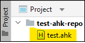
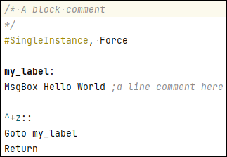
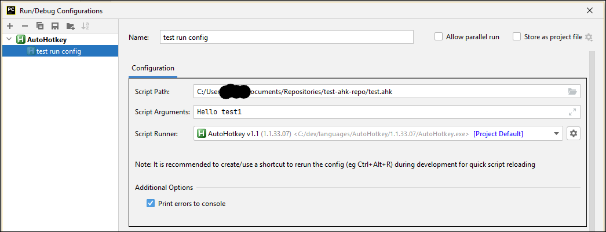
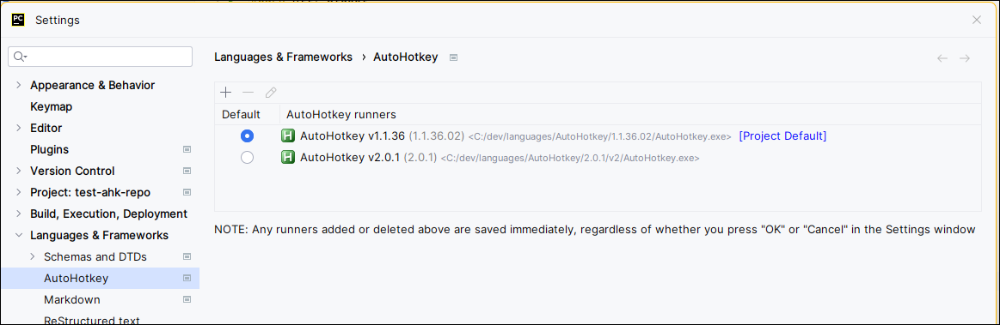
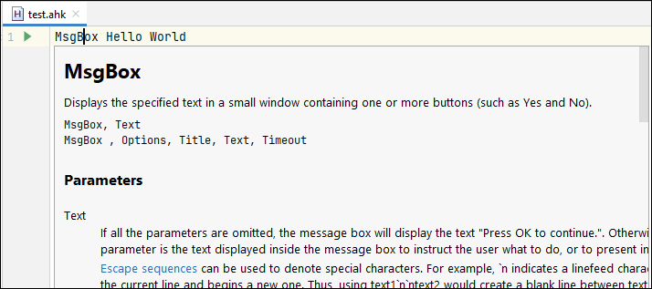

<!-- PROJECT SHIELDS -->
[![Contributors][contributors-shield]][contributors-url]
[![Forks][forks-shield]][forks-url]
[![Stargazers][stars-shield]][stars-url]
[![Issues][issues-shield]][issues-url]
[![GPL-3.0 License][license-shield]][license-url]


<!-- PROJECT LOGO -->
<br />
<p align="center">
  <a href="https://github.com/Nordgedanken/intellij-autohotkey">
    
  </a>

  <h3 align="center">AutoHotkey Plugin for the IntelliJ Platform</h3>

  <p align="center">
    A simple plugin to bring support for AutoHotkey into IntelliJ-based IDEs!
    <br />
    <a href="https://github.com/Nordgedanken/intellij-autohotkey"><strong>Explore the docs »</strong></a>
    <br />
    <br />
    <a href="https://plugins.jetbrains.com/plugin/13945-autohotkey-language">Get Plugin</a>
    ·
    <a href="https://github.com/Nordgedanken/intellij-autohotkey/issues">Report Bug</a>
    ·
    <a href="https://github.com/Nordgedanken/intellij-autohotkey/issues">Request Feature</a>
  </p>
</p>


<!-- TABLE OF CONTENTS -->
## Table of Contents
* [About the Project](#about-the-project)
  <!--* [Built With](#built-with)-->
* [Getting Started](#getting-started)
  * [Prerequisites](#prerequisites)
  * [Setting up a Development Environment](#setting-up-a-development-environment)
* [Roadmap](#roadmap)
* [Contributing](#contributing)
* [License](#license)
* [Contact](#contact)
* [Acknowledgements](#acknowledgements)


<!-- ABOUT THE PROJECT -->
## About The Project
<!-- Plugin description -->
A simple plugin for developing AutoHotkey scripts. The following features are available:

- Syntax highlighting (under construction; v1 only; no error checking available currently)
- Run configurations (v1 and v2)
- Quick documentation
- More to come in the future... 

Check out the <a href="https://github.com/Nordgedanken/intellij-autohotkey#usage">README</a> on the plugin's GitHub page for more information on using this plugin.

<p><i>Note: This plugin is under development and does not have a stable release yet. Please report any issues to the plugin's <a href="https://github.com/Nordgedanken/intellij-autohotkey/issues">GitHub page</a>.</i></p>

<hr>
Dependencies:

- Archive Browser plugin (for documentation assistance)

<!-- Plugin description end -->

<!-- [![Plugin Screenshot][product-screenshot]](https://plugins.jetbrains.com/plugin/13945-autohotkey-language) -->

<!-- USAGE EXAMPLES
Use this space to show useful examples of how a project can be used. Additional screenshots, code examples and demos work well in this space.
-->
## Usage
Install the plugin from the [JetBrains Marketplace][jetbrains-marketplace-plugin-page]. The following features will become enabled:

- **AutoHotkey File Recognition**  
  
- **Syntax Highlighting** (under construction; not complete yet)  
  
- **Run Configurations**  
  Allows you to run AutoHotkey scripts right in your IDE at the click of a button (or shortcut). Errors are logged straight to the console for easy debugging. Custom script arguments can be defined within the run configuration's settings.
    
  > Note: Run configurations can be auto-generated and executed by clicking the green triangle in the gutter as seen next to Line 1 in the "Quick Documentation" screenshot.
- **AutoHotkey Settings Page**  
  Custom page that allows you to manage AutoHotkey executables on your machine and swap between them easily in run configurations. 
  
- **Quick Documentation**  
  
  > Note: The hyperlink shown at the bottom of the documentation popup will link to either the v1 or v2 documentation based on which executable you selected as the default in the AutoHotkey settings page.
- **Line/Block Commenting**  
  Comments are toggled by selecting the comment action within the "Code" menu


<!-- GETTING STARTED -->
## Getting Started
To get a local copy up and running, follow these simple steps:

### Prerequisites
* IntelliJ IDEA 2020.* or newer (Community Edition is fine)  
  Required plugins (for development only):
  - [Grammar-Kit](https://plugins.jetbrains.com/plugin/6606-grammar-kit)
  - [PsiViewer](https://plugins.jetbrains.com/plugin/227-psiviewer)
  - [Kotest](https://plugins.jetbrains.com/plugin/14080-kotest)
  - [Ktlint](https://plugins.jetbrains.com/plugin/15057-ktlint-unofficial-)
* Java 11

### Setting up a Development Environment
1. Clone the repo
```sh
git clone https://github.com/Nordgedanken/intellij-autohotkey.git
```
2. Open the cloned folder in IntelliJ
3. Run the `"Run Plugin in test IDE"` run configuration


<!-- ROADMAP -->
## Roadmap
See the [open issues](https://github.com/Nordgedanken/intellij-autohotkey/issues) for a list of proposed features (and known issues).


<!-- CONTRIBUTING -->
## Contributing
Contributions are what make the open source community such an amazing place to learn, inspire, and create. Any contributions you make are greatly appreciated, **but please read [CONTRIBUTING.md](CONTRIBUTING.md) before starting any work**.


<!-- LICENSE -->
## License
Distributed under the GPL-3.0 License. See `LICENSE` for more information.


<!-- CONTACT -->
## Contact
MTRNord - [@mtrnord](https://github.com/mtrnord) - https://matrix.to/#/@mtrnord:nordgedanken.dev

Project Link: [https://github.com/Nordgedanken/intellij-autohotkey](https://github.com/Nordgedanken/intellij-autohotkey)


<!-- ACKNOWLEDGEMENTS -->
## Acknowledgements
* [intellij-rust](https://github.com/intellij-rust/intellij-rust) which provided a huge starting point to implement undocumented features
* [intellij python plugin](https://github.com/JetBrains/intellij-community/tree/master/python) which also provided help with certain features
* [idea-multimarkdown](https://github.com/vsch/idea-multimarkdown) which also provided help with certain features


<!-- MARKDOWN LINKS & IMAGES -->
<!-- https://www.markdownguide.org/basic-syntax/#reference-style-links -->
[contributors-shield]: https://img.shields.io/github/contributors/Nordgedanken/intellij-autohotkey.svg?style=flat-square
[contributors-url]: https://github.com/Nordgedanken/intellij-autohotkey/graphs/contributors
[forks-shield]: https://img.shields.io/github/forks/Nordgedanken/intellij-autohotkey.svg?style=flat-square
[forks-url]: https://github.com/Nordgedanken/intellij-autohotkey/network/members
[stars-shield]: https://img.shields.io/github/stars/Nordgedanken/intellij-autohotkey.svg?style=flat-square
[stars-url]: https://github.com/Nordgedanken/intellij-autohotkey/stargazers
[issues-shield]: https://img.shields.io/github/issues/Nordgedanken/intellij-autohotkey.svg?style=flat-square
[issues-url]: https://github.com/Nordgedanken/intellij-autohotkey/issues
[license-shield]: https://img.shields.io/github/license/Nordgedanken/intellij-autohotkey.svg?style=flat-square
[license-url]: https://github.com/Nordgedanken/intellij-autohotkey/blob/master/LICENSE
[product-screenshot]: images/screenshot.png

[jetbrains-marketplace-plugin-page]: https://plugins.jetbrains.com/plugin/13945-autohotkey/
